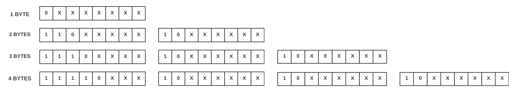

# Unicode Decoder

This C-based Unicode Decoder offers a straightforward solution for decoding Unicode characters. Whether it's a character within ASCII or the UTF-8 extension, the program swiftly provides essential information such as the Unicode code point, decimal value, and official character name. Unlike relying on Google searches, which may misinterpret characters and often lack all three pieces of aforementioned information in one place, this Unicode Decoder ensures a more efficient and faster way to obtain accurate details once set up and running.

## Features

- **ASCII Character Decoding:** Reads decimal value of ASCII characters by casting input type allowing for faster searching of name index than UTF-8 characters.

- **UTF-8 Character Decoding:** Analyzes the first byte of input `char` to determine variable byte length of the character, then decodes each subsequent byte to generate decimal value and Unicode code point to search name index.

## How does it work?

When a user enters an ASCII character, the program can cast the `char` as an `int`, as a part of the C-standard library. This is because ASCII characters all have a single-byte representation, allowing for the program to quickly translate the character into Unicode code point and decimal value. As the name index is organized by increasing code point value, the code points of ASCII values are the smallest, allowing for fast searching of the 128 possible ASCII characters.



UTF-8 vastly expands upon the ASCII table of characters by allowing characters to use up to 4 bytes. In UTF-8, the prefix of the first byte tells us how many bytes that character uses, for example, if a character uses 3 bytes, the prefix of the first byte will be 1110xxxx. The remaining bytes of the character are called continuation bytes, and provide the information for the character, and each begins with 10xxxxxx. This decoder examines the first byte, then shifts all bits in the subsequent continuation bytes by `6*n` positions, with `n` being the distance of that byte from the least significant byte. This is done to account for the 2-digit prefix of each continuation byte and allows us to calculate the decimal value of the character, and thus the Unicode code point and the name of the character.

## Installation and Use

Follow these steps to set up and run the Unicode Decoder in C:

1. Clone the repository to your local machine:

   ```bash
   git clone https://github.com/Daksh2060/unicode-decoder-c
   ```

2. Use the provided makefile to compile and run:

   ```bash
   make
   ./utf8
   ```

3. Enter a character to get information, for example:

   ```bash
   >B
   Decimal Value: 66
   Unicode Codepoint: U+0042
   Character Name: LATIN CAPITAL LETTER B
   ```

   ```bash
   >च
   Decimal Value: 2330
   Unicode Codepoint: U+091A
   Character Name: DEVANAGARI LETTER CA
   ```

   ```bash
   >😃
   Decimal Value: 128515
   Unicode Codepoint: U+1F603
   Character Name: SMILING FACE WITH OPEN MOUTH
   ```

4. To terminate program, enter a single `!`:

   ```bash
   !
   ```

   *Note: This means the `!` character is the only ASCII which can not be read.

## Contact

Feel free to reach out if you have any questions, suggestions, or feedback:

- **Email:** dpa45@sfu.ca
- **LinkedIn:** [@Daksh Patel](https://www.linkedin.com/in/daksh-patel-956622290/)
